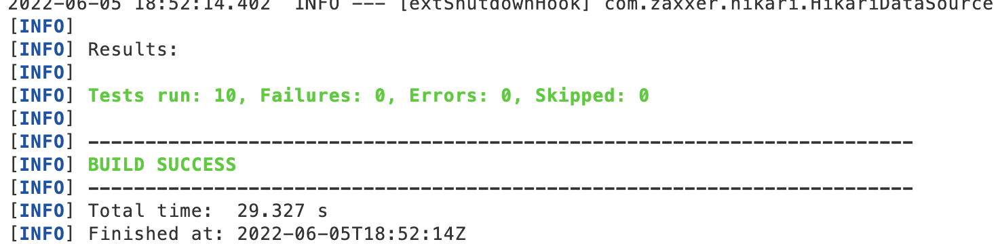

# bayes-dota-challenge
Read Events from Logs and Analyse 

This is the [task](TASK.md).

Any additional information about your solution goes here.

----------------------

Solution:

1. DB Used: H2 In-Memory Database
2. Used Regex to read the data from logs and Factory design pattern to process logs (Important Classes - ProcesserEngine, ProcesserFactory, MatchProcesser).
    Observations:
    1. We could use thrid party tools like logstash(ELK), Apache Spark etc but for this POC i kept it simple and didn't use 3rd party libs.
    2. While processing logs printing number of processed logs count for - valid, invalid logs, not interested logs.
    3. Inserting records can be optimized but as of now its not bulk insert.
3. Used JPA Repository for query execution.
4. While processing matches, I am storing payload as a string for reconciliation in case of any failure. 
5. Used Spring Integration Testing Freamwork to test solution end to end.
    1. Covered both the files provided in data folder.
    2. In ``DotaChallengeApplicationTests`` Total testcases are 10 for all endpoints.
    3. Make sure your java enviornment path is on JRE not JDK (If you will run java on JDK mvn clean test will give error).

How to run/test

1. To run the Spring boot application use
  `mvn spring-boot:run`

2. To test the solution run 
  `mvn clean test`
  

  

